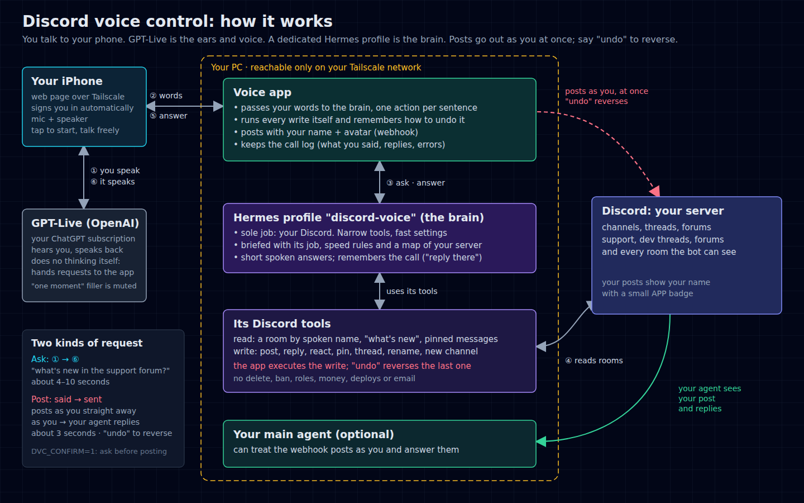

# Discord Voice Control

> **V2:** a hands-free operator console for an agent-run Discord. Catch up, delegate, and track what
> you asked for, by voice, with the actual messages and media on screen and live updates when work
> finishes. See [`docs/V2-AUDIT.md`](docs/V2-AUDIT.md) for the log audit behind it.

Talk to your Discord server. Ask "what did I miss?", "what's happening in the support forum?",
or "post in general: shipping the fix tonight", and hear the answer spoken back in a natural voice
from your phone.

It was built to run a server full of AI agents (support queues, dev threads, approval rooms) hands
free: catch up while walking, reply to a thread, start a new one, pin a decision, all by voice.



## What it does

- **Reads:** catch up across the server, summarise a channel, thread or forum, read pins, find rooms
  by their spoken name ("support queue" finds `support-queue`).
- **Writes:** post, reply, react, pin, start a thread (or forum post), rename, create a channel.
  Posts go out as **you** (your name and avatar, through a webhook the app owns), straight away.
- **Undo:** say "undo" to reverse the last action: delete the post or thread, remove the reaction,
  unpin, rename back, or delete the new channel.
- **Ignores background talk:** the mic is open for the whole call, so filler ("mhm", "oh yeah") and
  people talking in the room are filtered out before they reach the brain (`src/intent.mjs`). A post
  goes out at once only when you actually asked to post; anything else is held for a "yes".
- **Short spoken answers:** about 70 words are spoken, then "Want more?". The full answer is in the
  chat, and "more" reads the rest.
- **Safe by design:** no deleting other people's messages, no bans, no role or permission changes.
  Text inside Discord messages is treated as data, never as instructions.

## How the voice works

```
Phone (browser)  ──WebRTC audio──▶  GPT-Live (OpenAI realtime voice, your ChatGPT sign-in)
      ▲                                   │ "delegation": the user asked something
      │ spoken answer                     ▼
      └──────────────── this app (Node, on your PC) ──▶ the brain ──▶ Discord REST API
```

1. **GPT-Live is only the ears and mouth.** It hears you, decides when you asked for something, and
   hands the request off ("client delegation"). It never touches Discord itself.
2. **The app** relays each request to the **brain** and sends the answer back to the exact request
   it belongs to. Every answer is paired to its own question turn, so a slow answer can never be
   spoken in reply to a newer question.
3. **The brain** reads Discord with a small set of narrow tools and writes a short, speakable reply.
   Two brains are included:
   - `hermes` (default): a dedicated [Hermes Agent](https://hermes-agent.nousresearch.com) profile
     whose only job is your Discord, given the tools through an MCP server (`src/mcp.mjs`).
   - `direct`: a ChatGPT text model called by the app itself, with the **same** tools and the
     same server prompt, no Hermes in the middle (`src/direct-brain.mjs`).
4. **Writes** are proposed by the brain and executed by the app (not by the model), which also
   records how to undo them.

Note: on a ChatGPT sign-in, GPT-Live does not accept custom tools in its session (`tools` and
OpenAI-hosted "responses" delegation are rejected on that route), which is why the tools live
behind the delegation hand-off. `scripts/probe-session.mjs` and `scripts/probe-events.mjs` test this
against the live service.

## Requirements

- Node.js 20+
- A ChatGPT plan with GPT-Live voice, signed in with the Codex CLI (`codex login`). The app reads
  `~/.codex/auth.json`; it never writes it.
- A Discord bot in your server with: View Channels, Read Message History, Send Messages, Send
  Messages in Threads, Create Public Threads, Manage Webhooks, Add Reactions, Manage Messages (pins),
  and Manage Channels (only if you want rename/create by voice).
- For the default brain: Hermes Agent with its API server enabled.
- To use it from your phone: [Tailscale](https://tailscale.com) (`tailscale serve`; keeps it off the
  public internet).

## Install

```bash
git clone https://github.com/<you>/discord-voice-control
cd discord-voice-control
npm install            # only needed for the e2e/probe scripts (playwright)
cp .env.example .env   # fill in DISCORD_BOT_TOKEN, DVC_GUILD, DVC_OWNER ...
npm test
npm start              # http://127.0.0.1:3077
```

The first start writes a random access code to `.local/access-code`; the page asks for it once.

### Brain option A: Hermes profile (default)

```bash
hermes profile create discord-voice
cp hermes-profile/SOUL.example.md ~/.hermes/profiles/discord-voice/SOUL.md     # edit the server map
# merge hermes-profile/config.example.yaml into ~/.hermes/profiles/discord-voice/config.yaml
```

Set `DVC_HERMES_URL`, `DVC_PROFILE` and `DVC_HERMES_KEY` (the profile's `API_SERVER_KEY`) in `.env`.

### Brain option B: direct (no Hermes)

Set `DVC_BRAIN=direct` in `.env`, or pick **B** in the Brain menu on the page. No Hermes needed; it
uses your ChatGPT sign-in for a text model (`DVC_TEXT_MODEL`) and your server prompt from
`.local/server-prompt.md` (falls back to `hermes-profile/SOUL.example.md`).

### Split test A vs B

The page has a **Brain** menu (A = Hermes profile, B = direct). It applies from the next call.
Every answer is logged with its brain, time taken and length; compare them with:

```bash
node scripts/log-report.mjs 24
# brain A: 12 answers, median 6.8s, slowest 14.2s, avg 160 words
# brain B: 10 answers, median 6.9s, slowest 7.9s, avg 95 words
```

### On your phone

```bash
tailscale serve --bg --https=8443 http://127.0.0.1:3077
```

Open `https://<your-machine>.<tailnet>.ts.net:8443` on your phone and tap **Start talking**. If your
Tailscale login is listed in `DVC_TAILNET_OWNERS`, you are signed in automatically; otherwise enter
the access code.

To keep it running, use a systemd user service (`ExecStart=/usr/bin/node /path/to/src/server.mjs`,
`Restart=always`).

## V2 features

- **Your requests:** every post and thread the app made, with honest live status: *Working*,
  *Needs you* (a decision is waiting), *Replied* or *Done*, plus the latest reply. Ask "did everything
  go through?" and it answers in one call (`my_requests`).
- **Live updates:** when someone or an agent replies to anything you sent, the phone chimes and shows
  it, and during a call the voice tells you in one sentence (it waits until nobody is talking).
  Progress noise from agents ("⏳ working… iteration 21/800") is filtered out.
- **Lock-screen pings:** when a request is *Done* or *Needs you* and no call is live, the bot replies
  in that thread with one line that mentions you (`🔔 @you omo finished: …`), so the Discord app
  notifies you even with the phone locked. At most one per room every 2 minutes; skipped when the
  reply already mentions you. Set `DVC_OWNER` to your Discord user id to enable it.
- **See what it's talking about:** every answer carries the Discord messages it used as tappable
  cards (room, author, time, link), with images and videos inline.
- **Memory across calls:** a dropped call doesn't lose the conversation; "that thread" still works.
- **Threads you start are followed:** the opening post mentions you, so the thread shows in your
  sidebar and notifies you.
- **No double posts:** the same message to the same room within 60 seconds is sent once.

## The phone page

One big mic button: tap to talk, tap **End** to hang up. **Undo last** reverses the app's last
action (only enabled when there is one), **Mute** turns your mic off without ending the call.
Suggestions and a text box cover the times you can't talk. **Hermes / Direct** in the header picks the
brain for the next call. Add it to your home screen for a full-screen app.

## Configuration

All settings are environment variables; see [`.env.example`](.env.example). Useful ones:

- `DVC_CONFIRM=1`: ask for a spoken "yes" before every write instead of posting at once.
- `DVC_WEBHOOK_NAME`: the webhook the app posts through (shown with Discord's APP badge).
- `DVC_VOICE`: GPT-Live voice (default `cove`).
- `DVC_TRACE=1`: record raw GPT-Live events to `.local/trace.jsonl` for debugging.

## Logs

Every call is logged to `.local/calls.jsonl` (rotates at 5 MB): what you said, the replies, every
write, errors, and phone events such as the screen locking. Summarise it with:

```bash
node scripts/log-report.mjs 24   # last 24 hours
```

## Limits

- **iPhone screen lock:** iOS cuts the microphone of a web page about two seconds after the screen
  locks. Keep the screen on while talking; a native app would be needed to listen with it locked.
- Discord webhooks cannot create native replies, reactions or pins. Replies quote and link the
  original; reactions, pins, renames and new channels are done by the bot account.
- Posts appear with Discord's APP badge. Posting from a user account (a "self-bot") breaks Discord's
  terms, so this project does not do it.

## Tests

```bash
npm test                                   # unit tests, no network
URL=http://127.0.0.1:3077 node scripts/voice-e2e.mjs path/to/question.wav   # real GPT-Live call with a recorded question
```

## License

MIT
